<!--
  Perfil de Juanma Fernández — sistema «Cinta» (Nº 001).
  · Piezas estáticas: /assets (SVG animados, variantes -dark / -light).
  · Piezas dinámicas: rama `output`, regeneradas cada 12 h por .github/workflows/profile.yml.
  · Fuentes de diseño y generadores: /design y /scripts.
-->

<picture>
  <source media="(prefers-color-scheme: dark)" srcset="assets/hero-dark.svg">
  <source media="(prefers-color-scheme: light)" srcset="assets/hero-light.svg">
  
</picture>

  

<!-- ───────────────────────── 01 · SOBRE MÍ ───────────────────────── -->

<picture>
  <source media="(prefers-color-scheme: dark)" srcset="assets/section-01-dark.svg">
  <source media="(prefers-color-scheme: light)" srcset="assets/section-01-light.svg">
  
</picture>

<picture>
  <source media="(prefers-color-scheme: dark)" srcset="assets/about-dark.svg">
  <source media="(prefers-color-scheme: light)" srcset="assets/about-light.svg">
  
</picture>

  

<!-- ───────────────────────── 02 · STACK ───────────────────────── -->

<picture>
  <source media="(prefers-color-scheme: dark)" srcset="assets/section-02-dark.svg">
  <source media="(prefers-color-scheme: light)" srcset="assets/section-02-light.svg">
  
</picture>

<picture>
  <source media="(prefers-color-scheme: dark)" srcset="assets/stack-dark.svg">
  <source media="(prefers-color-scheme: light)" srcset="assets/stack-light.svg">
  
</picture>

  

<!-- ───────────────────────── 03 · PROYECTOS ───────────────────────── -->

<picture>
  <source media="(prefers-color-scheme: dark)" srcset="assets/section-03-dark.svg">
  <source media="(prefers-color-scheme: light)" srcset="assets/section-03-light.svg">
  
</picture>

<a href="https://juanma-dev-portfolio.vercel.app/"><picture><source media="(prefers-color-scheme: dark)" srcset="assets/project-portfolio-dark.svg"><source media="(prefers-color-scheme: light)" srcset="assets/project-portfolio-light.svg"></picture></a>

<a href="https://genetix-xi.vercel.app/"><picture><source media="(prefers-color-scheme: dark)" srcset="assets/project-genetix-dark.svg"><source media="(prefers-color-scheme: light)" srcset="assets/project-genetix-light.svg"></picture></a>
<a href="https://genetix-arena.vercel.app/"><picture><source media="(prefers-color-scheme: dark)" srcset="assets/project-genetix-arena-dark.svg"><source media="(prefers-color-scheme: light)" srcset="assets/project-genetix-arena-light.svg"></picture></a>

  

<!-- ───────────────────────── 04 · ACTIVIDAD (generado por la Action) ───────────────────────── -->

<picture>
  <source media="(prefers-color-scheme: dark)" srcset="assets/section-04-dark.svg">
  <source media="(prefers-color-scheme: light)" srcset="assets/section-04-light.svg">
  
</picture>

<picture>
  <source media="(prefers-color-scheme: dark)" srcset="https://raw.githubusercontent.com/Ju4nmaFd3z/Ju4nmaFd3z/output/stats-dark.svg">
  <source media="(prefers-color-scheme: light)" srcset="https://raw.githubusercontent.com/Ju4nmaFd3z/Ju4nmaFd3z/output/stats-light.svg">
  
</picture>

<picture>
  <source media="(prefers-color-scheme: dark)" srcset="https://raw.githubusercontent.com/Ju4nmaFd3z/Ju4nmaFd3z/output/city-dark.svg">
  <source media="(prefers-color-scheme: light)" srcset="https://raw.githubusercontent.com/Ju4nmaFd3z/Ju4nmaFd3z/output/city-light.svg">
  
</picture>

  

<!-- ───────────────────────── 05 · CONTACTO ───────────────────────── -->

<picture>
  <source media="(prefers-color-scheme: dark)" srcset="assets/section-05-dark.svg">
  <source media="(prefers-color-scheme: light)" srcset="assets/section-05-light.svg">
  
</picture>

<a href="https://www.linkedin.com/in/juanma-fern%C3%A1ndez-rodr%C3%ADguez/"><picture><source media="(prefers-color-scheme: dark)" srcset="assets/contact-linkedin-dark.svg"><source media="(prefers-color-scheme: light)" srcset="assets/contact-linkedin-light.svg"></picture></a>
<a href="mailto:juanmafr2007@gmail.com"><picture><source media="(prefers-color-scheme: dark)" srcset="assets/contact-gmail-dark.svg"><source media="(prefers-color-scheme: light)" srcset="assets/contact-gmail-light.svg"></picture></a>
<a href="https://juanma-dev-portfolio.vercel.app/"><picture><source media="(prefers-color-scheme: dark)" srcset="assets/contact-portfolio-dark.svg"><source media="(prefers-color-scheme: light)" srcset="assets/contact-portfolio-light.svg"></picture></a>
<a href="https://github.com/Ju4nmaFd3z"><picture><source media="(prefers-color-scheme: dark)" srcset="assets/contact-github-dark.svg"><source media="(prefers-color-scheme: light)" srcset="assets/contact-github-light.svg"></picture></a>

  

<picture>
  <source media="(prefers-color-scheme: dark)" srcset="assets/footer-dark.svg">
  <source media="(prefers-color-scheme: light)" srcset="assets/footer-light.svg">
  
</picture>

